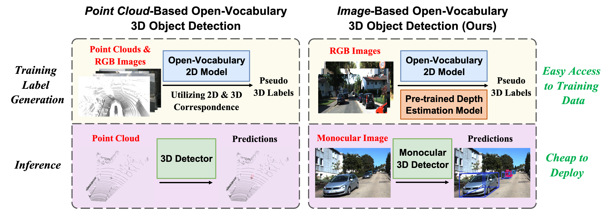

# OVM3D-Det

**Training an Open-Vocabulary Monocular 3D Object Detection Model without 3D Data**

[Rui Huang][rh], [Henry Zheng][hz], [Yan Wang][yw], [Zhuofan Xia][zx], [Marco Pavone][mp], [Gao Huang][gh]

[[`Project Page`](https://ovm3d-det.github.io/)] [[`arXiv`](https://arxiv.org/pdf/2411.15657)] [[`BibTeX`](#citing)]


We propose a novel open-vocabulary monocular 3D object detection framework, dubbed OVM3D-Det, which trains detectors using only RGB images, making it both cost-effective and scalable to publicly available data.

## Table of Contents
1. [Installation](#installation)
2. [Data](#data)
3. [Pseudo-Label Generation](#pseudo-label-generation)
4. [Test](#test)
5. [Training](#training)
6. [Citing](#citing)
7. [Acknowledgement](#acknowledgement)

## Installation
We follow the main dependencies of Cube R-CNN and have added dependencies for UniDepth and Grounded-SAM.

- [Detectron2][d2]
- [PyTorch][pyt]
- [PyTorch3D][py3d]
- [COCO][coco]
- [UniDepth][uni]
- [Grounded-SAM][gm]

``` bash
# setup new evironment
conda create -n ovm3d python=3.10
conda activate ovm3d

conda install pytorch==2.0.1 torchvision==0.15.2 torchaudio==2.0.2 pytorch-cuda=11.8 -c pytorch -c nvidia
conda install -c fvcore -c iopath -c conda-forge -c pytorch3d -c pytorch fvcore iopath pytorch3d

# OpenCV, COCO, detectron2
pip install cython opencv-python
pip install 'git+https://github.com/cocodataset/cocoapi.git#subdirectory=PythonAPI'

cd third_party
git clone git@github.com:facebookresearch/detectron2.git
python -m pip install -e detectron2
 
# other dependencies
conda install -c conda-forge scipy seaborn

# install dependencies for Unidepth
cd UniDepth
pip install -e .

# install dependencies for Grounded-Segment-Anything
cd ../Grounded-Segment-Anything 
python -m pip install -e segment_anything
pip install --no-build-isolation -e GroundingDINO

pip install scikit-learn
```

## Data
We utilize four datasets from Omni3D: `KITTI`, `nuScenes`, `SUN RGB-D` and `ARKitScenes`. For detailed instructions on downloading and setting up the images and annotations, please refer to the [Omni3D data guide](https://github.com/facebookresearch/omni3d/blob/main/DATA.md).


## Pseudo-Label Generation
We provide pre-generated pseudo labels [here](https://drive.google.com/drive/folders/1SsmnElIFlz_7yPWkAhkc_QVIlhtj53LE?usp=drive_link) for the training and validation sets. Please place them in the `datasets` folder. To generate pseudo labels yourself, follow these steps by running:
```bash
bash scripts/generate_pseudo_label.sh DATASET
```
Specifically:

```bash
DATASET=$1

# Step 1: Predict depth using UniDepth
CUDA_VISIBLE_DEVICES=0 python third_party/UniDepth/run_unidepth.py --dataset $DATASET

# Step 2: Segment novel objects also the ground using Grounded-SAM
CUDA_VISIBLE_DEVICES=0 python third_party/Grounded-Segment-Anything/grounded_sam_detect.py --dataset $DATASET
CUDA_VISIBLE_DEVICES=0 python third_party/Grounded-Segment-Anything/grounded_sam_detect_ground.py --dataset $DATASET

# Step 3: Generate pseudo 3D bounding boxes
python tools/generate_pseudo_bbox.py \
  --config-file configs/Base_Omni3D_${DATASET}.yaml \
  OUTPUT_DIR output/generate_pseudo_label \

# Step 4: Convert to COCO dataset format
python tools/transform_to_coco.py --dataset_name $DATASET
```
Replace `DATASET` with the name of the dataset you are working with.


## Test
To evaluate the trained models, download the pre-trained models and place them in the checkpoints folder.

|Datasets|Link|
|-----|------|
|KITTI|[Google Drive][kitti]|
|nuScenes|[Google Drive][nuscenes]|
|SUNRGBD|[Google Drive][sunrgbd]|
|ARKitScenes|[Google Drive][arkit]|

```
bash scripts/test.sh DATASET
```


## Training
To train the model from scratch, run:
```
bash scripts/train.sh DATASET
```


## Citing
If you find this repo helpful, please consider citing us.
```BibTeX
@inproceedings{huang2024training,
    title={Training an Open-Vocabulary Monocular 3D Detection Model without 3D Data},
    author={Rui Huang and Henry Zheng and Yan Wang and Zhuofan Xia and Marco Pavone and Gao Huang},
    booktitle={The Thirty-eighth Annual Conference on Neural Information Processing Systems},
    year={2024},
}
```


## Acknowledgement
We build upon the source code of [Cube R-CNN][cube], [UniDepth][uni], [Grounded-SAM][gm], [WeakM3D][wm], and [OV-3DET][ov3det]. We sincerely thank the authors for their efforts.


[rh]: https://scholar.google.com/citations?user=ieN4b1QAAAAJ&hl=zh-CN&oi=sra
[hz]: https://scholar.google.com/citations?user=gZCggycAAAAJ&hl=en
[yw]: https://research.nvidia.com/labs/avg/author/yan-wang/
[zx]: https://www.zhuofanxia.xyz/
[mp]: https://profiles.stanford.edu/marco-pavone
[gh]: https://www.gaohuang.net/
[d2]: https://github.com/facebookresearch/detectron2
[py3d]: https://github.com/facebookresearch/pytorch3d
[pyt]: https://pytorch.org/
[coco]: https://cocodataset.org/
[cube]: https://github.com/facebookresearch/omni3d
[uni]: https://github.com/lpiccinelli-eth/UniDepth
[gm]: https://github.com/IDEA-Research/Grounded-Segment-Anything
[wm]: https://github.com/SPengLiang/WeakM3D
[ov3det]: https://github.com/lyhdet/OV-3DET
[kitti]: https://drive.google.com/drive/folders/1qccl9FOU-0mTxMJ_SeGX06xrPeurAZe-?usp=drive_link
[nuscenes]: https://drive.google.com/drive/folders/1d0PF-rDbl7xryRXdOc-io73zvQXI5_8B?usp=drive_link
[sunrgbd]: https://drive.google.com/drive/folders/1Iuzn6nvC2Lw4626hyM5dCsR9Cdes9bwX?usp=drive_link
[arkit]: https://drive.google.com/drive/folders/1vtsiIuYF0hEY2kI8pjNalPcJkgpJQmH0?usp=drive_link